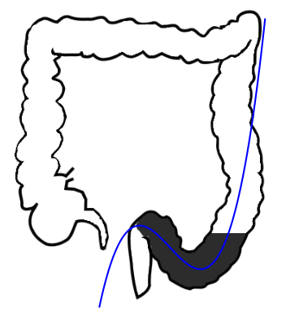
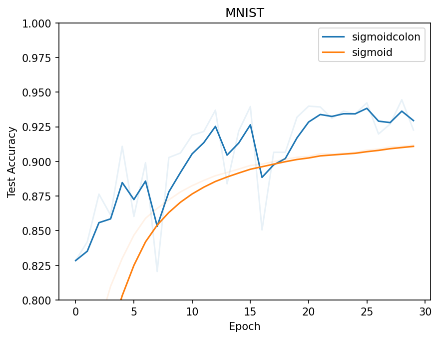

# Sigmoid Colon

<p align="center">
    <a href="https://github.com/poopingface/sigmoidcolon/blob/main/LICENSE">
        
    </a>
    <a href="https://poopingface.github.io/sigmoidcolon">
        
    </a>
    <a href="https://github.com/poopingface/sigmoidcolon/releases">
        
    </a>
</p>



The biologically inspired activation function. [Read our (toilet) paper](https://poopingface.github.io/sigmoidcolon).

## Installation

Install with pip:

```bash
pip install sigmoidcolon
```

## Usage

Class version

```python
from torch import nn
from sigmoidcolon import SigmoidColon

model = nn.Sequential(
    nn.Linear(784, 64),
    SigmoidColon()
    nn.Linear(64, 10)
)
```

Functional version

```python
from torch import nn
from sigmoidcolon.functional import sigmoidcolon

x = torch.randn(100)
y = sigmoidcolon(x)
```

## Development

Not satisfied with the function? Redo it with:

```bash
# install dev requirements
pip install Pillow numpy matplotlib

# run code generation tool
python scripts/codegen.py docs/sigmoidcolon.png
```

